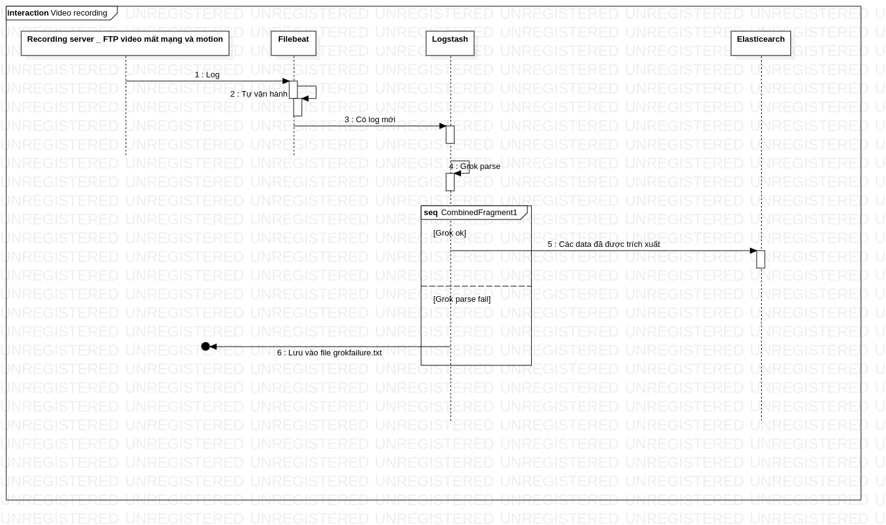

Giới thiệu


Hệ thống quản lý để lưu trữ và trích xuất video được họat động như sau:

   1. Khi server record hay ftp lưu thành công 1 vídeo record, một tấm hình. Một dòng log sẽ được sinh ra để báo việc lưu đã hoàn thành.
        Video log của video recording
            Wowza ( Đang được sử dụng):

2019-03-21 15:39:41 ICT comment server INFO 200 - MyStreamRecorderListener.onSegmentEnd[3410][http://118.69.82.122:1234/thumbnails/nghia_2018-10-05-17.30.39.443-ICT_6_2018-10-05-19.00.43.245-ICT.jpg][HCM][/personaltest/1553157576.mp4][118.69.82.122][1553157576][2019/03/21 - 15:39:36][personaltest] - - - 14118.31 - - - - - - - - - - - - - - -- - - - - - - - - -

        *   SRS (Sẽ bổ sung)
    *   Image log của FTP motion:
``` shell
Mon Mar 25 11:34:08 2019 [pid 55389] [chivt2] OK UPLOAD: Client "118.69.167.41", "/192.168.2.148_001216dbcf97/2019-03-25/01/pic/1134014294959552.jpg", 66472 bytes, 110.86Kbyte/sec

    Video log của FTP motion
    ``` shell
    Sat Mar 23 03:00:34 2019 [pid 11852] [chivt2] OK UPLOAD: Client "118.69.167.41", "/192.168.2.148_001216dbcf97/2019-03-23/01/rec/03.00.10-03.00.20[M][@8a6][0].h264", 571376 bytes, 597.56Kbyte/sec

### Grok parse tương ứng; (vào relation tài liệu elasticsearch, logstash, filebeat để hiểu hơn về grok)
 * Wowza Recording:
``` python
(?<logdate>[%{YEAR}]+-[%{MONTHNUM}]+-[%{MONTHDAY}]+\s*[%{HOUR}]+:(?:[0-5][0-9]):(?:(?:[0-5]?[0-9]|60)(?:[:.,][0-9]+)?))\t.*?\t.*?\t.*?\t.*?\t.*?\tMyStreamRecorderListener.onSegmentEnd\[(?<duration>[+-]?(?:[0-9]+))]\[%{DATA:image}]\[%{DATA:location}]\[%{DATA:savepath}]\[%{DATA:recordlocation}]\[(?<recordtimestampwowza>[+-]?(?:[0-9]+))]\[%{DATA:debuginfo}]\[%{DATA:wowza_application}]\t

    FTP Motion Image:

(?<ftplogdate>%{DAY}+%{SPACE}%{MONTH} %{MONTHDAY} %{TIME} %{YEAR}) %{DATA:vsftpd_pid} \[%{DATA:camera_serial}\] %{WORD:vsftpd_action_status} %{WORD:vsftpd_action}: Client \"%{IP:vsftpd_client_ip}\"(, \"(?<vsftp_path>.*\/(?<daterecord>%{YEAR}-%{MONTHNUM}-%{MONTHDAY})\/.*\/.*\/(?<timerecord>(?:[+-]?(?:[0-9]))(?:[+-]?(?:[0-9]))(?:[+-]?(?:[0-9]))(?:[+-]?(?:[0-9]))(?:[+-]?(?:[0-9]))(?:[+-]?(?:[0-9]))).*.jpg)\",%{DATA:vsftpd_file_size}, %{DATA:vsftpd_file_transfer_speed})$

    FTP Motion Video:

(?<ftplogdate>(?:Mon(?:day)?|Tue(?:sday)?|Wed(?:nesday)?|Thu(?:rsday)?|Fri(?:day)?|Sat(?:urday)?|Sun(?:day)?)+ (?:Jan(?:uary)?|Feb(?:ruary)?|Mar(?:ch)?|Apr(?:il)?|May|Jun(?:e)?|Jul(?:y)?|Aug(?:ust)?|Sep(?:tember)?|Oct(?:ober)?|Nov(?:ember)?|Dec(?:ember)?) (?:(?:0[1-9])|(?:[12][0-9])|(?:3[01])|[1-9]) (?!<[0-9])(?:2[0123]|[01]?[0-9]):(?:[0-5][0-9])(?::(?:(?:[0-5]?[0-9]|60)(?:[:.,][0-9]+)?))(?![0-9]) (?>\d\d){1,2}) %{DATA:vsftpd_pid} \[%{DATA:camera_serial}\] %{WORD:vsftpd_action_status} %{WORD:vsftpd_action}: Client \"(?<vsftpd_client_ip>(?<![0-9])(?:(?:25[0-5]|2[0-4][0-9]|[0-1]?[0-9]{1,2})[.](?:25[0-5]|2[0-4][0-9]|[0-1]?[0-9]{1,2})[.](?:25[0-5]|2[0-4][0-9]|[0-1]?[0-9]{1,2})[.](?:25[0-5]|2[0-4][0-9]|[0-1]?[0-9]{1,2}))(?![0-9]))\"(, \"(?<vsftp_path>.*\/(?<daterecordv>(?>\d\d){1,2}-(?:0?[1-9]|1[0-2])-(?:(?:0[1-9])|(?:[12][0-9])|(?:3[01])|[1-9]))\/.*\/.*\/(?<timerecordv>(?:[+-]?(?:[0-9]+)).(?:[+-]?(?:[0-9]+)).(?:[+-]?(?:[0-9]+))).*.h264)\",%{DATA:vsftpd_file_size}, %{DATA:vsftpd_file_transfer_speed})$

Kết quả logstash:
Wowza:

{

    "_index": "camipctest_camrecord",
    "_type": "camerarecord",
    "_id": "bsFon2kBnfuCnKagDm4r",
    "_version": 1,
    "_score": 1,
    "_source": {
        "beat": {
            "name": "localhost.localdomain",
            "version": "6.5.4",
            "hostname": "localhost.localdomain"
        },
        "location": "HCM",
        "host": {
            "name": "localhost.localdomain"
        },
        "module": "Wowza",
        "@timestamp": "2019-03-21T08:39:45.807Z",
        "@version": "1",
        "debuginfo": "2019/03/21 - 15:39:36",
        "logcategory": "server",
        "logdate": "2019-03-21 15:39:41",
        "prospector": {
            "type": "log"
        },
        "recordlocation": "118.69.82.122",
        "offset": 79707,
        "image": "http://118.69.82.122:1234/thumbnails/nghia_2018-10-05-17.30.39.443-ICT_6_2018-10-05-19.00.43.245-ICT.jpg",
        "input": {
            "type": "log"
        },
        "recordtimestampwowza": "1553157576",
        "duration": "3410",
        "savepath": "/personaltest/1553157576.mp4",
        "wowza_application": "personaltest",
        "source": "/usr/local/WowzaStreamingEngine/logs/wowzastreamingengine_access.log",
        "tagName": "CAMERA_RECORD_LOG",
        "recordtimestamp": "2019-03-21T08:39:36.000Z"
    }

}

Vsftp video:

{

    "_index": "camipctest_camrecord",
    "_type": "camerarecord",
    "_id": "2R5UxGkBnfuCnKagoiwE",
    "_version": 1,
    "_score": 1,
    "_source": {
        "@version": "1",
        "offset": 180,
        "vsftpd_action": "UPLOAD",
        "vsftpd_file_transfer_speed": "597.56Kbyte/sec",
        "source": "/home/ansible/demo.log",
        "vsftpd_pid": "[pid 11852]",
        "beat": {
            "hostname": "localhost.localdomain",
            "version": "6.7.0",
            "name": "localhost.localdomain"
        },
        "timerecordv": "03.00.10",
        "ftplogdate": "Sat Mar 23 03:00:34 2019",
        "camera_serial": "chivt2",
        "vsftpd_file_size": " 571376 bytes",
        "prospector": {
            "type": "log"
        },
        "@timestamp": "2019-03-28T12:44:33.993Z",
        "vsftp_path": "/192.168.2.148_001216dbcf97/2019-03-23/01/rec/03.00.10-03.00.20[M][@8a6][0].h264",
        "host": {
            "name": "localhost.localdomain"
        },
        "vsftpd_action_status": "OK",
        "recordtimestampftpv": "2019-03-23 03.00.10",
        "vsftpd_client_ip": "118.69.167.41",
        "daterecordv": "2019-03-23",
        "module": "Vsftp_vid",
        "recordtimestamp": "2019-03-22T20:00:10.000Z",
        "log": {
            "file": {
                "path": "/home/ansible/demo.log"
            }
        },
        "input": {
            "type": "log"
        }
    }

}

Vsftp pic:

{

    "_index": "camipctest_camrecord",
    "_type": "camerarecord",
    "_id": "2x5UxGkBnfuCnKagoiwP",
    "_version": 1,
    "_score": 1,
    "_source": {
        "vsftpd_action": "UPLOAD",
        "offset": 0,
        "@version": "1",
        "vsftpd_file_transfer_speed": "110.86Kbyte/sec",
        "source": "/home/ansible/demo.log",
        "vsftpd_pid": "[pid 55389]",
        "timerecord": "113401",
        "beat": {
            "hostname": "localhost.localdomain",
            "version": "6.7.0",
            "name": "localhost.localdomain"
        },
        "ftplogdate": "Mon Mar 25 11:34:08 2019",
        "daterecord": "2019-03-25",
        "camera_serial": "chivt2",
        "vsftpd_file_size": " 66472 bytes",
        "prospector": {
            "type": "log"
        },
        "@timestamp": "2019-03-28T12:44:33.993Z",
        "vsftp_path": "/192.168.2.148_001216dbcf97/2019-03-25/01/pic/1134014294959552.jpg",
        "host": {
            "name": "localhost.localdomain"
        },
        "vsftpd_action_status": "OK",
        "recordtimestampftp": "2019-03-25 113401",
        "vsftpd_client_ip": "118.69.167.41",
        "module": "Vsftp_pic",
        "recordtimestamp": "2019-03-25T04:34:01.000Z",
        "log": {
            "file": {
                "path": "/home/ansible/demo.log"
            }
        },
        "input": {
            "type": "log"
        }
    }

}

Muốn 3 bạn này sống chung với nhau cần 1 template cho type index trong elasticsearch:

{
    "index_patterns": ["camipctest*"],
    "settings": {
      "number_of_shards": 1
    },
      "mappings": {
        "camerarecord": {
          "properties": {
            "@timestamp": {
              "type": "date"
            },
            "@version": {
              "type": "text",
              "fields": {
                "keyword": {
                  "type": "keyword",
                  "ignore_above": 256
                }
              }
            },
            "beat": {
              "properties": {
                "hostname": {
                  "type": "text",
                  "fields": {
                    "keyword": {
                      "type": "keyword",
                      "ignore_above": 256
                    }
                  }
                },
                "name": {
                  "type": "text",
                  "fields": {
                    "keyword": {
                      "type": "keyword",
                      "ignore_above": 256
                    }
                  }
                },
                "version": {
                  "type": "text",
                  "fields": {
                    "keyword": {
                      "type": "keyword",
                      "ignore_above": 256
                    }
                  }
                }
              }
            },
            "camera_serial": {
              "type": "text",
              "fields": {
                "keyword": {
                  "type": "keyword",
                  "ignore_above": 256
                }
              }
            },
            "daterecord": {
              "type": "date"
            },
            "debuginfo": {
              "type": "text",
              "fields": {
                "keyword": {
                  "type": "keyword",
                  "ignore_above": 256
                }
              }
            },
            "duration": {
              "type": "text",
              "fields": {
                "keyword": {
                  "type": "keyword",
                  "ignore_above": 256
                }
              }
            },
            "ftplogdate": {
              "type": "text",
              "fields": {
                "keyword": {
                  "type": "keyword",
                  "ignore_above": 256
                }
              }
            },
            "host": {
              "properties": {
                "name": {
                  "type": "text",
                  "fields": {
                    "keyword": {
                      "type": "keyword",
                      "ignore_above": 256
                    }
                  }
                }
              }
            },
            "image": {
              "type": "text",
              "fields": {
                "keyword": {
                  "type": "keyword",
                  "ignore_above": 256
                }
              }
            },
            "input": {
              "properties": {
                "type": {
                  "type": "text",
                  "fields": {
                    "keyword": {
                      "type": "keyword",
                      "ignore_above": 256
                    }
                  }
                }
              }
            },
            "location": {
              "type": "text",
              "fields": {
                "keyword": {
                  "type": "keyword",
                  "ignore_above": 256
                }
              }
            },
            "log": {
              "properties": {
                "file": {
                  "properties": {
                    "path": {
                      "type": "text",
                      "fields": {
                        "keyword": {
                          "type": "keyword",
                          "ignore_above": 256
                        }
                      }
                    }
                  }
                }
              }
            },
            "logcategory": {
              "type": "text",
              "fields": {
                "keyword": {
                  "type": "keyword",
                  "ignore_above": 256
                }
              }
            },
            "logdate": {
              "type": "text",
              "fields": {
                "keyword": {
                  "type": "keyword",
                  "ignore_above": 256
                }
              }
            },
            "module": {
              "type": "text",
              "fields": {
                "keyword": {
                  "type": "keyword",
                  "ignore_above": 256
                }
              }
            },
            "offset": {
              "type": "long"
            },
            "prospector": {
              "properties": {
                "type": {
                  "type": "text",
                  "fields": {
                    "keyword": {
                      "type": "keyword",
                      "ignore_above": 256
                    }
                  }
                }
              }
            },
            "recordlocation": {
              "type": "text",
              "fields": {
                "keyword": {
                  "type": "keyword",
                  "ignore_above": 256
                }
              }
            },
            "recordtimestamp": {
              "type": "date"
            },
            "recordtimestampftp": {
              "type": "text",
              "fields": {
                "keyword": {
                  "type": "keyword",
                  "ignore_above": 256
                }
              }
            },
            "savepath": {
              "type": "text",
              "fields": {
                "keyword": {
                  "type": "keyword",
                  "ignore_above": 256
                }
              }
            },
            "source": {
              "type": "text",
              "fields": {
                "keyword": {
                  "type": "keyword",
                  "ignore_above": 256
                }
              }
            },
            "tagName": {
              "type": "text",
              "fields": {
                "keyword": {
                  "type": "keyword",
                  "ignore_above": 256
                }
              }
            },
            "tags": {
              "type": "text",
              "fields": {
                "keyword": {
                  "type": "keyword",
                  "ignore_above": 256
                }
              }
            },
            "timerecord": {
              "type": "text",
              "fields": {
                "keyword": {
                  "type": "keyword",
                  "ignore_above": 256
                }
              }
            },
            "vsftp_path": {
              "type": "text",
              "fields": {
                "keyword": {
                  "type": "keyword",
                  "ignore_above": 256
                }
              }
            },
            "vsftpd_action": {
              "type": "text",
              "fields": {
                "keyword": {
                  "type": "keyword",
                  "ignore_above": 256
                }
              }
            },
            "vsftpd_action_status": {
              "type": "text",
              "fields": {
                "keyword": {
                  "type": "keyword",
                  "ignore_above": 256
                }
              }
            },
            "vsftpd_client_ip": {
              "type": "text",
              "fields": {
                "keyword": {
                  "type": "keyword",
                  "ignore_above": 256
                }
              }
            },
            "vsftpd_file_size": {
              "type": "text",
              "fields": {
                "keyword": {
                  "type": "keyword",
                  "ignore_above": 256
                }
              }
            },
            "vsftpd_file_transfer_speed": {
              "type": "text",
              "fields": {
                "keyword": {
                  "type": "keyword",
                  "ignore_above": 256
                }
              }
            },
            "vsftpd_pid": {
              "type": "text",
              "fields": {
                "keyword": {
                  "type": "keyword",
                  "ignore_above": 256
                }
              }
            },
            "wowza_application": {
              "type": "text",
              "fields": {
                "keyword": {
                  "type": "keyword",
                  "ignore_above": 256
                }
              }
            }
          }
        }
      }
    }


