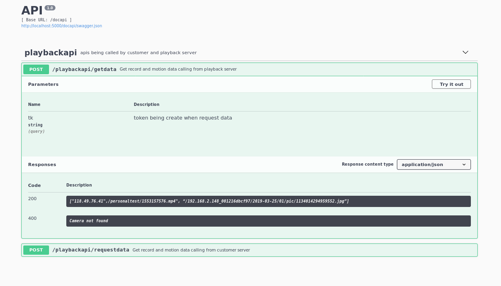
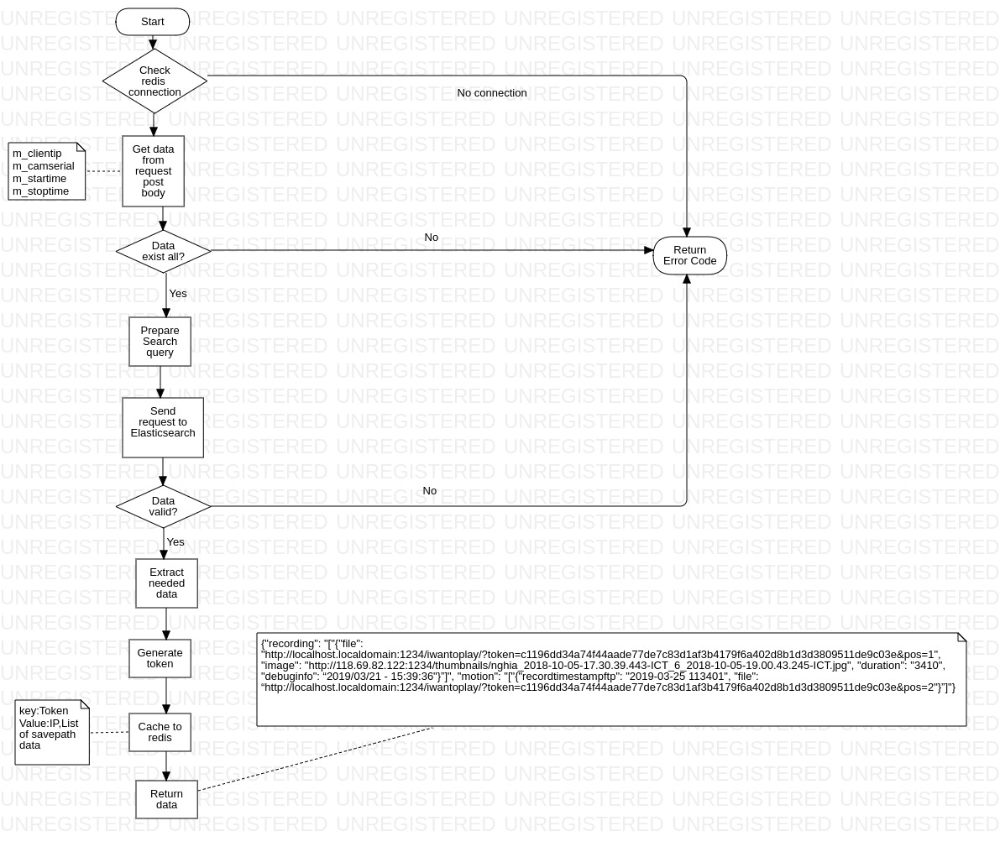

Playback api là một phần của hệ thống phục vụ việc xem lại các video đựoc recording trong 1 khỏang thời gian, check relation để biết tài liệu liên quan:

Flowchart code của Playback API và Playback server:

1.  Request data:

    

2.  Get data:

    

3.  Cấu trúc thư mục:

        ├── app
        │ ├── __init__.py
        │ ├── models
        │ │ ├── examplemodel.py
        │ │ ├── __init__.py
        │ ├── personalulti.py
        │ └── views
        │ ├── __init__.py
        │ ├── playbackapi.py
        │ └── restplusexampleapi.py
        ├── app.db
        ├── example.sql
        ├── flask-playback.service
        ├── gunicorn
        │ └── config.py
        ├── __init__.py
        ├── instance
        │ ├── app.db
        │ ├── config.py
        │ ├── __init__.py
        ├── migrations
        │ ├── alembic.ini
        │ ├── env.py
        │ ├── README
        │ ├── script.py.mako
        │ └── versions
        ├── requirement.txt
        ├── run.py
        ├── systemd
        │ └── env
        └── tests
        ├── __init__.py
        └── test_api.py

    -  Ý nghĩa các thư mục:

        *   Ứng dụng flask bao gồm unit testing quá trình ci/cd git yeahspace, docapi online, và monitor bằng prometheus.

        *   Follow theo file `tests/test_api.py` test\_api.py nhớ viết test case trước khi viết code.
        *   Viết code logic vào thư mục app/views tham khảo file `app/views/playbackapi.py`
        *   Viết doc cho code logic mình vừa viết tham khảo file `app/views/restplusexampleapi.py`
        *   Đăng kí Blueprint vào file `app/__init.py` Ex:

                from app.views.playbackapi import playbackapi
                app.register_blueprint(playbackapi, url_prefix="/playbackapi")

4.  Khi commit code ci/cd của gitlab sẽ chạy và team lead sẽ phải quan tâm và review lại code

5.  Running

*   Chạy thử test case:

        export PYTHONPATH=.
        export FLASK_CONFIG=development
        export FLASK_APP=run.py
        pytest tests --cov=app.views --cov-report term

*   Các bước deploy:
*   Vào file `flask-playback.service` và file `systemd/env` để sửa lại các path sao cho phù hợp với hệ thống đang được deploy
*   Copy file `flask-playback.service` vào `/etc/systemd/system/` xong rồi

        systemctl deamon-reload
        systemctl start flask-playback.service
