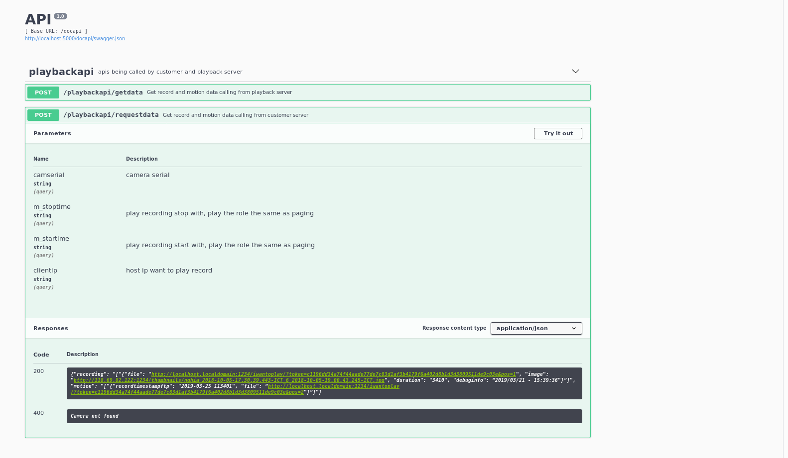
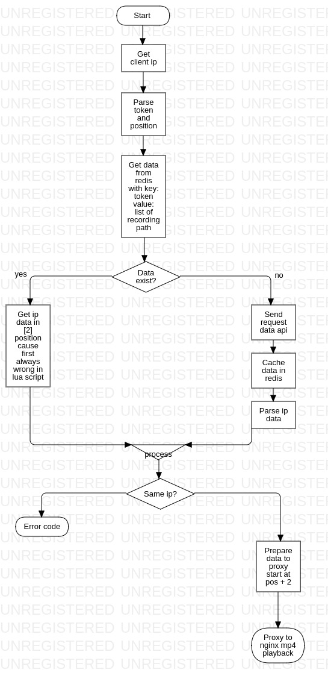

OpenResty Playback nằm trong 1 phần trong hệ thống xem lại video recording, và video cũng như motion pic, check tài liệu motion để có bức tranh tổng quan.

-   Module này nhận nhiệm vụ phục vụ các request yêu cầu xem các file yêu cầu đã được mã hóa trong playback api

    

-   Flow code Playback

    

-   Các bước triển khai:

    -   Get openresty
    -   `yum install perl-Digest-MD5`
    -   Export openresty/bin folder to ~/.bash-profile
    -   install opm packages:
        -   pintsized/lua-resty-http 0.12
        -   tomas/lua-resty-elasticsearch 0.03
        -   openresty/lua-resty-redis 0.25
        -   openresty/lua-resty-string 0.11
        -   openresty/lua-resty-lrucache 0.08
        -   openresty/lua-resty-core
    -   cp restysecu.service to /lib/systemd/system/

-   Cần quan tâm 2 thư mục `nginx/conf` và `nginx/luasource`:

-   `/etc/nginx/nginx.conf`

        user nginx;
        worker_processes 1;
        pid logs/nginx.pid;
        error_log logs/error.log;
        events {
            worker_connections 1024;
        }
        http {
            lua_package_path "$prefix/resty_modules/lualib/?.lua;;";
            lua_package_cpath "$prefix/resty_modules/lualib/?.so;;";

            init_by_lua_file ./luasource/initialize.lua;
            upstream upstream-localhost {
                server 118.69.82.122:3000;
            }

            server {
                listen 1234;
                root /home/nginx/openresty/nginx/html;

                location / {

                }
                location /iwanttoplay/ {  #route url /iwantoplay/ to lua code
                    set $target '';
                    lua_code_cache off; #enables livereload for development
                    access_by_lua_file ./luasource/checkplay.lua;
                    proxy_pass $target;
                    proxy_redirect off;
                    proxy_set_header Host $host;
                    proxy_set_header X-Real-IP $remote_addr;
                    proxy_set_header X-Forwarded-For $proxy_add_x_forwarded_for;
                }
            }
        }

-   LUA CODE

        .luasource
        ├── checkplay.lua #Flow code in here
        └── initialize.lua
