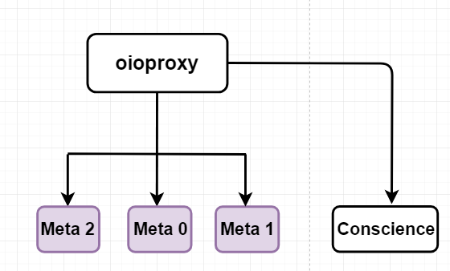

•	Oioproxy (Meta-proxy) service là 1 HTTP proxy được dùng để yêu cầu (request) Conscience/Meta0/Meta1/Meta2 services thông quan HTTP REST hoặc API.

•	Sơ đồ PUT operation a container:

  1. Meta-Proxy - Conscience: Conscience đánh điểm các service mà Consience-agent theo dõi. Yêu cầu này được thực hiện cứ sau 5 giây theo mặc định (có thể cấu hình).
  2. Meta1 - Meta-Proxy: lấy danh sách rawx và rdir từ meta1 service. Yêu cầu này được thực hiện mỗi 1 giây theo mặc định (có thể cấu hình).
  3. Meta2 - Meta-Proxy: lấy danh sách điểm của rawx, namespace storage policy và chunk size. Yêu cầu này được thực hiện mỗi 1 giây theo mặc định (có thể cấu hình).
  4. SDK Client - Meta-Proxy: chuẩn bị gọi hàm với các tham số:  container name, object name, size, storage policy.
  5. Meta-Proxy - Meta0: lấy danh sách meta1 (Retrieve all Meta1)
  6. Meta-Proxy - Meta1: lấy danh sách meta2 (Retrieve the Meta2 service)
  7. Meta-Proxy - Meta2: Truy xuất rawx có sẵn để lưu trữ nội dung với storage policy được cấu hình ở namespace.
  8. Meta-Proxy - SDK Client: trả về danh sách Rawx
  9. SDK Client - Rawx: upload chunks cho mỗi rawx trả về trước đó. Rawx service tạo ra event cho Rdir service.
  10. SDK Client - Meta-Proxy: gọi tạo hàm xác nhận tạo object
  11. Meta-Proxy - Meta2: xác nhận tất cả location của chunks trên các rawx.
  
