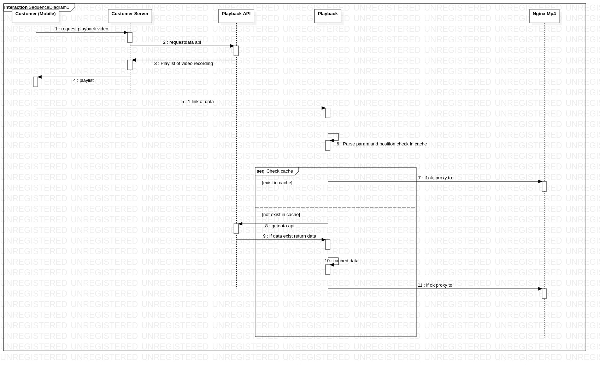

###   

End of the insertion Giới thiệu:

Một chương trình được viết theo framework Flask của Python nhằm phục vụ viễn cảnh sau:

Mô tả: Người dùng muốn xem lại các video, khoẳng khắc bao gồm hình và cả video đã được lưư lại trên 1 máy vật lý đã được xác đình trên hệ thống(vào relation để biết thêm 2 flow video recording và khoẳng khắc hệ thống để hiểu rõ hơn).

Gọi khách hàng là client hệ thống hoạt động bao gồm các bước:

1\. Begin of the insertion End of the insertion Request playback api: Cái này bên team backend xử lí.

2\. Begin of the insertion End of the insertion Server backend gọi request data api của team mình lấy video hình ảnh được lưu lại trong 1 khung thời gian

3\. Begin of the insertion End of the insertion Mình trả lời 1 danh sách bao gồm video recording, hình ảnh cho server backend.

4\. Begin of the insertion End of the insertion Bên backend trả lời cái playlist cho client của họ.

5\. Begin of the insertion End of the insertion Khi client muốn play thì họ lấy 1 cái link trong đống playlist gọi lên server playback của mình. 6.7.8.9.10.11. Là các bước bên trong hệ thống xử lí để giúp client play hoặc xem được cái hình, video đó.

Quan trọng là 3 bước: \`2.requestdata api, 5. sẽ gọi api trên playback, 8. getdata api:
